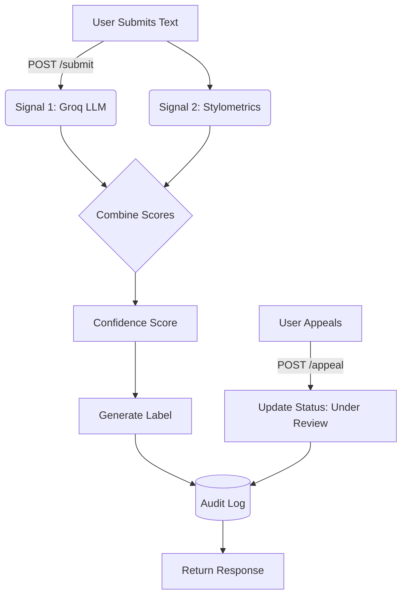

# Provenance Guard Planning

## Detection Signals
1. **LLM-Based Classification (Groq)**:
   - **What it measures**: Evaluates the semantic coherence, tone, and stylistic choices of the text to determine if it reads like it was generated by an AI or written by a human.
   - **Blind spots**: May struggle with highly formal or academic human writing that inherently lacks emotional variation, or heavily prompted AI output designed to mimic human flaws.
   - **Output**: A confidence score between 0.0 (Definitely Human) and 1.0 (Definitely AI).

2. **Stylometric Heuristics (Python)**:
   - **What it measures**: Analyzes structural properties of the text such as sentence length variance and vocabulary diversity (type-token ratio). AI writing tends to be structurally uniform, whereas human writing varies more naturally.
   - **Blind spots**: Can be fooled by AI text specifically prompted to vary sentence lengths, or human writing that is naturally very structured (e.g., legal documents).
   - **Output**: A score between 0.0 and 1.0 based on structural regularity.

## Uncertainty Representation & Confidence Scoring
- Both signals will be combined to calculate a final confidence score from 0.0 to 1.0. 
- **0.0 - 0.35**: Likely Human
- **0.36 - 0.64**: Uncertain
- **0.65 - 1.0**: Likely AI
- A score of `0.5` represents maximum uncertainty (the system cannot confidently lean either way). 

## Transparency Label Design
- **High-Confidence AI (0.65 - 1.0)**: "This content was likely generated by AI."
- **Uncertain (0.36 - 0.64)**: "The origin of this content is unclear; it may contain a mix of human and AI generation."
- **High-Confidence Human (0.0 - 0.35)**: "This content was likely written by a human."

## Appeals Workflow
- **Who can appeal**: Creators whose submitted content has been classified.
- **Information provided**: A `content_id` and the creator's reasoning (`creator_reasoning`) for the appeal.
- **System action**: Updates the content's status to "under review" and logs the appeal alongside the original decision in the audit log.
- **Human reviewer view**: Reviewers will see the original text, the individual signal scores, the final confidence score, and the creator's reasoning.

## Anticipated Edge Cases
1. **Academic or Legal Writing**: Highly structured human text with low sentence length variance might be misclassified as AI by the stylometric heuristics.
2. **Short, Casual Texts**: A 2-sentence informal post might not provide enough data for either signal to make a confident assessment, leading to false positives or an "Uncertain" label.

## Architecture
**Narrative**: 
1. **Submission Flow**: A request is made to `POST /submit` -> The text is evaluated by Signal 1 (Groq) and Signal 2 (Stylometrics) -> Scores are combined into a final confidence score -> A transparency label is generated based on the score -> The decision is recorded in the audit log -> Response is returned to the user.
2. **Appeal Flow**: A request is made to `POST /appeal` with reasoning -> The content status is updated to "under review" -> The appeal is recorded in the audit log -> Confirmation is returned.

## AI Tool Plan
- **M3 (Submission endpoint + first signal)**: Ask AI to generate Flask app skeleton with `POST /submit` route and the Groq signal function based on the Detection Signals spec. Verify by calling the function directly.
- **M4 (Second signal + confidence scoring)**: Ask AI to generate the stylometric heuristics function and confidence scoring logic based on the Uncertainty Representation spec. Verify by testing on 4 varied text inputs.
- **M5 (Production layer)**: Ask AI to generate label mapping logic based on Transparency Label Design and the `POST /appeal` endpoint based on Appeals Workflow. Verify by checking log entries and label outputs.
